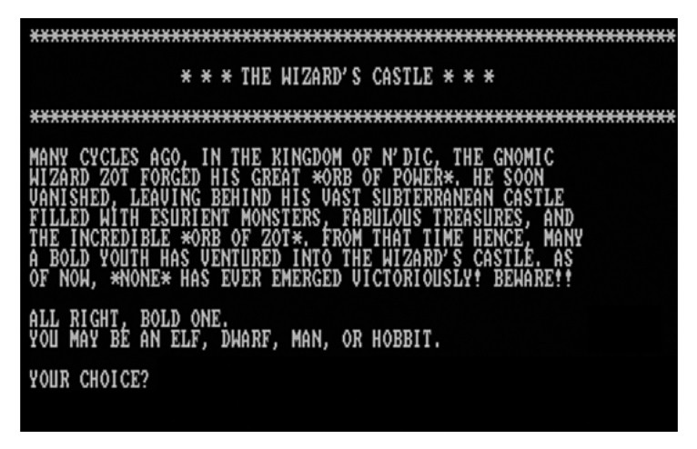

[Excerpt from [_Dungeons and Desktops: The History of Computer
Role-Playing
Games_](https://www.amazon.com/Dungeons-Desktops-History-Computer-Role-Playing/dp/1568814119)]

# _The Wizard's Castle_ and _Eamon_

These first two games are great examples of how the early computer
gaming industry was so much different from what we find later on. _The
Wizard's Castle_, for instance, wasn't published on disk or cassette, but
printed in a magazine. This practice, virtually unheard of today, was
common in the days when removable storage media (e.g., cassettes and
disks) were prohibitively expensive. Furthermore, since most computers
had such limited supplies of memory, games were by necessity written in
as few lines of code as possible. The upshot was that fully playable
games could be inputted in a few hours even by a certified
hunt-and-pecker. Besides, many people bought computers specifically to
learn programming, and typing in games seemed like an easy way to pursue
that goal. _The Wizard's Castle_, then, was just one of many of these
games that were fun to play and helpful to aspiring CRPG developers
(Figure 4.1).

Originally written by Joseph R. Power for Exidy's Sorcerer computer, _The
Wizard's Castle_ was ported to a variety of systems, a relatively easy
feat since it was programmed in BASIC. It's a simple game, with no
graphics and only a meager story. The player's character ("a bold
youth") must descend into the subterranean castle of the gnomic wizard
Zot to fetch the all-powerful Orb of Zot. Players choose a race (elf,
dwarf, man, or hobbit) and gender, then allocate attribute points into
three stats: strength, intelligence, and dexterity. They can then
purchase armor, weapons, lamps, and flares. There are also magical
items, such as a green gem that prevents memory loss, an opal eye that
cures blindness, or manuals that permanently boost stats. Again, what's
so impressive about this game is that all of this was crammed into 5,000
[_It was actually 341 lines of BASIC -Beej_] lines of code! The game is
survived today by a freeware version with sprite-based graphics,
programmed by a man calling himself "Derelict" who also hosts the source
code to the original game.

FIGURE 4.1 _The Wizard's Castle_ is one of the earliest CRPGs for home
computers. If you wanted to play it, you had to carefully transcribe it,
line by line, from a computing magazine.

In an email exchange with us concerning his game, Power remarked that
his first encounter with a CRPG was at a science fiction convention held
in 1975. Power was presented with an obscure mainframe game named
HOBBIT, which featured "minimal character creation" and a "messy"
stat-based combat system. Power remembers playing the game via a printer
terminal (there was no monitor display). Nevertheless, Power enjoyed the
game and decided he wanted to make his own, though improving on the
areas he found deficient.

-------
